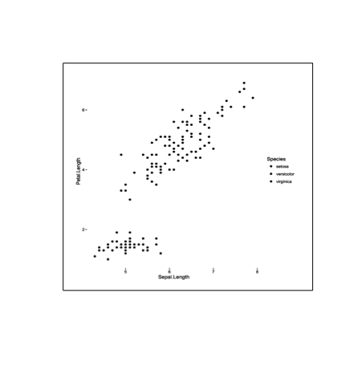

fugger
======

Preview plots when printed on poor hardware.

Not all the plots that you make in R will be viewed in their colorful and detailed glory. 
This package contains helper functions to help you preview plots under different conditions, such as grayscale or black and white printing, photocopying, or display via a washed-out projector.

## Installation
```r
# install.packages("devtools")
devtools::install_github("mdlincoln/fugger")
```

Basic grayscale and black & white filters

```r
library(fugger)
library(ggplot2)

iris_ggplot <- ggplot(iris, aes(x = Sepal.Length, y = Petal.Length, color = Species)) +
  geom_point()
  
fug_gs(iris_ggplot)
```


```r
fug_bw(iris_ggplot, threshold = "15%")
```



You can also pass any given imager function that returns a `cimg` object by using `fug_fun`:

```r
fug_fun(iris_ggplot, imager::isoblur, sigma = 3)
```


---
[Matthew Lincoln](http://matthewlincoln.net)
